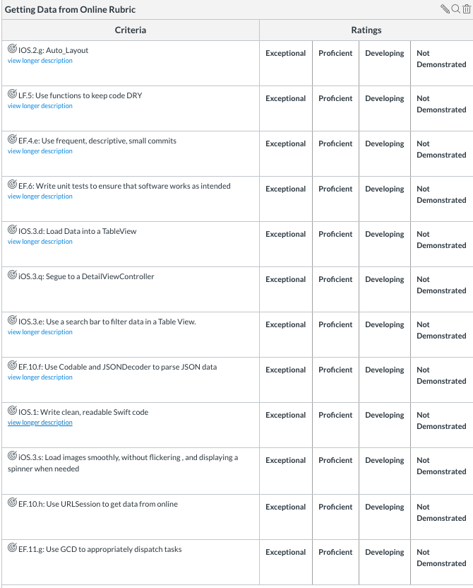

# Unit 3 Project 2 - Getting Data from Online

## Summary

Create an app where you can search for a tv show.  Selecting a show should display a list of all episodes in the TV show.  Selecting an episode should display a detail view controller with more information about the episode.

## Documentation:

[https://www.tvmaze.com/api](https://www.tvmaze.com/api)

# View Controller One: Shows

Your view controller should contain:

- A table view
- A search bar

Entering a search term should make a request to the API that loads information matching that description into the table view.  Your tableViewCell should have:

- An image of the show
- The name of the show
- Its rating

You will need to use a custom tableViewCell.

Selecting a show should segue to a view controller that lists the episodes.

# View Controller Two: Episodes

Your view controller should contain:

- A table view

The table view should have all the episodes from the show that the user selected.  The tableViewCell should have:

- An image of the episode
- The name of the episode
- The season and episode number

Selecting an episode should segue to a detail view controller that lists additional information.

# View Controller Three: Episode Detail

Your view controller should contain:

- A large image of the episode
- The episode's name
- The episode's season and episode number
- The episode's description

# Rubric

